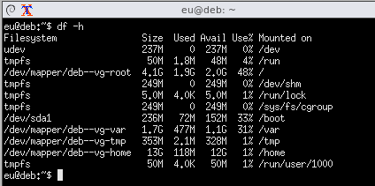
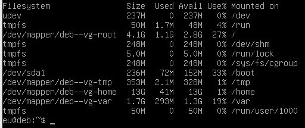

# Установка базовой системы

> [`<<`](../index.md)

## Разбивка диска

### Разбивка вручную

Объем диска: 20 Гб
- `/` - 9 Гб
- `swap` - 1 Гб
- `/home` - остальное

### Тестирование автоматической разбивки

При автоматической разбивке при объеме диска в 20 гигов корень получился размером всего 4 гига с копейками. Поставил пару браузеров и почти 50% в корнее съедено. В общем, картина такая:

Короче, надо разбивать **вручную**, как и делает автор видоса (у него корень размером 9 гигов).

А вот для сравнения вывод той же команды, но по состоянию после донастройки системы с установкой флюксбокса:

